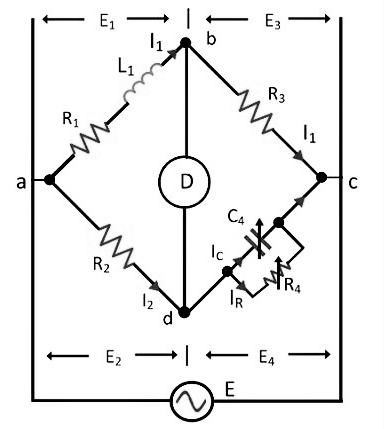
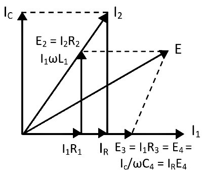

<head>

</head>

<h3>Introduction</h3>
A Maxwell bridge is a modification to a Wheatstone bridge used to measure an unknown inductance (usually of low Q value) in calibrated resistance and inductance or resistance and capacitance. The bridge is known as a Maxwell-Wien bridge when the calibrated components are a parallel resistor and capacitor. It is named for James C. Maxwell, who first described it in 1873.   
It uses the principle that the positive phase angle of an inductive impedance can be compensated by the negative phase angle of a capacitive impedance when put in the opposite arm and the circuit is at resonance; i.e., no potential difference across the detector (an AC voltmeter or ammeter)) and hence no current flows through it. The unknown inductance then becomes known in terms of this capacitance. 

 

**Fig. 1 Maxwell Bridge**

Regarding the picture, in a typical application R1 and R4 are known fixed entities, and R2 and  C2 are known variable entities. R2 and  C2 are adjusted until the bridge is balanced. R3 and  L3 can then be calculated based on the values of the other components

### Types of Maxwell’s Bridge
Two methods are used for determining the self-inductance of the circuit. They are

1. Maxwell’s Inductance Bridge
2. Maxwell’s inductance Capacitance Bridge

### Maxwell’s Inductance Bridge
In such type of bridges, the value of unknown resistance is determined by comparing it with the known value of the standard self-inductance. The connection diagram for the balance Maxwell bridge is shown in the figure below.

 

**Fig. 2 Maxwell Inductance Bridge**

Where, L1 – Unknown inductance of resistance R1. 
L2 – Variable inductance of fixed resistance r2. 
R2 – Variable resistance connected in series with inductor L2. 
R3, R4 – Known non-inductance resistance. 

At balance,

$$L_1 = \frac{R3}{R4}L2$$

$$R1 = \frac{R3}{R4}(R2+r2)$$

The value of the R3 and R4 resistance varies from 10 to 1000 ohms with the help of the resistance box. Sometimes for balancing the bridge, the additional resistance is also inserted into the circuit. The phasor diagram of Maxwell’s inductance bridge is shown in the figure below.

 

**Fig. 3 Phasor Diagram of Maxwell Inductance Bridge**

### Maxwell’s Inductance Capacitance Bridge
In this type of bridge, the unknown resistance is measured with the help of the standard variable capacitance. The connection diagram of the Maxwell Bridge is shown in the figure below.

 

**Fig. 4 Maxwell Inductance Capacitance Bridge**

For balance condition, 

$$(R1 + jωL_1) \left (\frac{R4}{1 + jωC_4R_4} \right ) = R2R3$$

$$R_1R_4 = jωL_1R_4 = R_2R_3 + jωC_4R_4R_2R_3$$

By separating the real and imaginary equation we get,

$$R_1 = \frac{R_2R_3}{R_4}$$

$$L_1 = R_2R_3C_4$$

The above equation shows that the bridges have two variables R4 and C4 which appear in one of the two equations and hence both the equations are independent. The circuit quality factor is expressed as 

$$Q = \frac{ωL_1}{R_1} = ωC_4R_4$$

The phasor diagram of Maxwell’s inductance capacitance bridge is shown in the figure below.

 

**Fig. 5 Phasor Diagram of Maxwell Inductance Capacitance Bridge**

### Advantages of the Maxwell’s Bridge:
The following are the advantages of the Maxwell bridge-

1. The balance equation of the circuit is free from frequency.
2. Both the balance equations are independent of each other.
3. Maxwell’s inductor capacitance bridge is used for the measurement of the high-range inductance.

### Disadvantages of the Maxwell’s Bridge:
The main disadvantages of the bridge are

1. The Maxwell inductor capacitance bridge requires a variable capacitor which is very expensive. Thus, sometimes the standard variable capacitor is used in the bridges.
2. The bridge is only used for the measurement of medium-quality coils.

