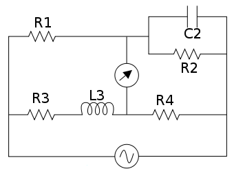

### Introduction
&nbsp;&nbsp;&nbsp;&nbsp;&nbsp;&nbsp;&nbsp;&nbsp;&nbsp;&nbsp;&nbsp;&nbsp;A Maxwell bridge is a modification to a Wheatstone bridge used to measure an unknown inductance (usually of low Q value) in terms of calibrated resistance and inductance or resistance and capacitance. When the calibrated components are a parallel resistor and capacitor, the bridge is known as a Maxwell-Wien bridge. It is named for James C. Maxwell, who first described it in 1873.  
&nbsp;&nbsp;&nbsp;&nbsp;&nbsp;&nbsp;&nbsp;&nbsp;&nbsp;&nbsp;&nbsp;&nbsp;It uses the principle that the positive phase angle of an inductive impedance can be compensated by the negative phase angle of a capacitive impedance when put in the opposite arm and the circuit is at resonance; i.e., no potential difference across the detector (an AC voltmeter or ammeter)) and hence no current flowing through it. The unknown inductance then becomes known in terms of this capacitance. 

 

**Fig. 1 Maxwell Bridge**

&nbsp;&nbsp;&nbsp;&nbsp;&nbsp;&nbsp;&nbsp;&nbsp;&nbsp;&nbsp;&nbsp;&nbsp;With reference to the picture, in a typical application R1 and R4 are known fixed entities, and R2 and  C2 are known variable entities. R2 and  C2 are adjusted until the bridge is balanced.

R3 and  L3 can then be calculated based on the values of the other components:

&nbsp;&nbsp;&nbsp;&nbsp;&nbsp;&nbsp;&nbsp;&nbsp;&nbsp;&nbsp;&nbsp;&nbsp;To avoid the difficulties associated with determining the precise value of a variable capacitance, sometimes a fixed-value capacitor will be installed and more than one resistor will be made variable. It cannot be used for the measurement of high Q values. It is also unsuited for the coils with low Q values, less than one, because of balance convergence problem. Its use is limited to the measurement of low Q values from 1 to 10.   
&nbsp;&nbsp;&nbsp;&nbsp;&nbsp;&nbsp;&nbsp;&nbsp;&nbsp;&nbsp;&nbsp;&nbsp;The frequency of the AC current used to assess the unknown inductor should match the frequency of the circuit the inductor will be used in - the impedance and therefore the assigned inductance of the component varies with frequency. For ideal inductors, this relationship is linear, so that the inductance value at an arbitrary frequency can be calculated from the inductance value measured at some reference frequency. Unfortunately, for real components, this relationship is not linear, and using a derived or calculated value in place of a measured one can lead to serious inaccuracies.

&nbsp;&nbsp;&nbsp;&nbsp;&nbsp;&nbsp;&nbsp;&nbsp;&nbsp;&nbsp;&nbsp;&nbsp;A practical issue in construction of the bridge is mutual inductance: two inductors in propinquity will give rise to mutual induction: when the magnetic field of one intersects the coil of the other, it will reinforce the magnetic field in that other coil, and vice versa, distorting the inductance of both coils. To minimize mutual inductance, orient the inductors with their axes perpendicular to each other, and separate them as far as is practical. Similarly, the nearby presence of electric motors, chokes and transformers (like that in the power supply for the bridge!) may induce mutual inductance in the circuit components, so locate the circuit remotely from any of these.

&nbsp;&nbsp;&nbsp;&nbsp;&nbsp;&nbsp;&nbsp;&nbsp;&nbsp;&nbsp;&nbsp;&nbsp;The frequency dependence of inductance values gives rise to other constraints on this type of bridge: the calibration frequency must be well below the lesser of the self-resonance frequency of the inductor and the self-resonance frequency of the capacitor,Fr < min(Lsrf,Csrf)/10. Before those limits are approached, the ESR of the capacitor will likely have significant effect, and have to be explicitly modeled.

&nbsp;&nbsp;&nbsp;&nbsp;&nbsp;&nbsp;&nbsp;&nbsp;&nbsp;&nbsp;&nbsp;&nbsp;For ferromagnetic core inductors, there are additional constraints. There is a minimum magnetization current required to magnetize the core of an inductor, so the current in the inductor branches of the circuit must exceed the minimum, but must not be so great as to saturate the core of either inductor.

&nbsp;&nbsp;&nbsp;&nbsp;&nbsp;&nbsp;&nbsp;&nbsp;&nbsp;&nbsp;&nbsp;&nbsp;The additional complexity of using a Maxwell-Wien bridge over simpler bridge types is warranted in circumstances where either the mutual inductance between the load and the known bridge entities, or stray electromagnetic interference, distorts the measurement results. The capacitive reactance in the bridge will exactly oppose the inductive reactance of the load when the bridge is balanced, allowing the load's resistance and reactance to be reliably determined.

